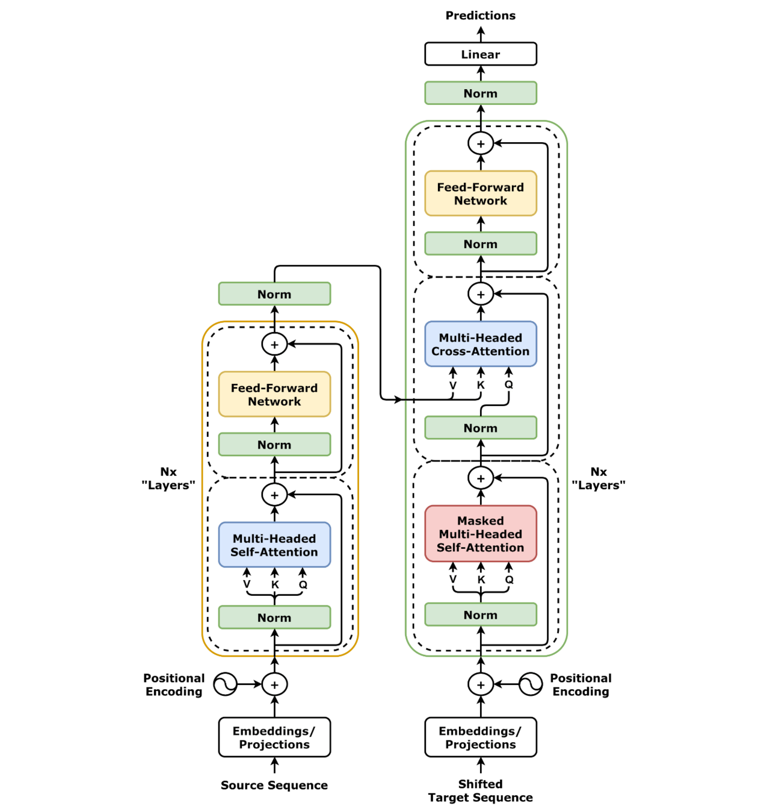
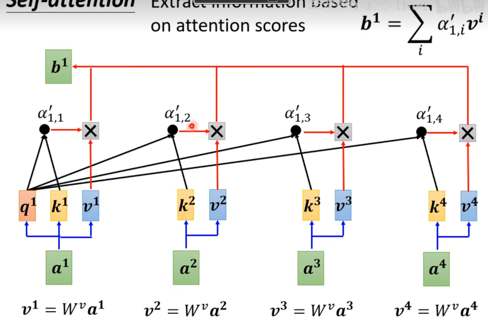

# 手搓Transformer代码详解

*本文使用英中翻译的例子，对Transformer从数据处理，模型搭建，训练过程，任务执行这几个部分进行代码的撰写和解释，同时在后面附上机器学习相关基础函数的解释，以及pytorch对一些张量的处理技巧*

## 总体介绍
Transformer本身的架构需要熟悉牢记于心，如图所示：


Transformer由Encoder和Decoder组成，数据处理后，输入的内容变成了固定长度的向量，和分词一一对应建立了索引关系；然后通过embedding，和 位置embedding输入模型，——> 多头注意力 ——> 残差链接+归一化 ——> FFN ——> 残差连接+归一化 ——>输入Decoder的编码器-解码器注意力 作为K和V

Decoder部分，输入向量Y，向右偏置，通过Embedding和位置embedding输入模型，掩码自注意力机制——> 残差连接+归一化 ——> 编码器解码器注意力机制 ——> FFN ——> 残差连接+归一化 最后输入到线性层

## 数据预处理
数据格式的介绍：
cn.test.txt 测试预料 中文 已经分词处理

cn.txt 训练语料 中文 已经分词处理

示例：欧洲人 如此 激烈 反对 美国 nmd 计划 , 使 欧洲 国家 的 政府 很 难 向 美国 的 压力 作出 妥协 。


en.test.txt 英文测试语料

en.txt 英文训练语料

示例：such a fierce opposition by europeans to the united states ' nmd program makes it very difficult for the governments of european countries to compromise under us pressure .


**数据处理后，希望建立每一个词的索引。变成数字格式，[batch_size, src_seq_len]，批次处理n个句子，每个句子长度是固定的，比如把['我是猫','不要回答，不要回答']，转变为[[1,2,3,4,5,6],[7,8,9,10,11,12],[7,8,9,10,11,12]]**

其中转换时候需要确定几项内容，确定最大的句子长度max_len，确定几个特色token，\<pad>代表掩码，\<unk>代表未知内容，\<bos>代表句子开头，\<eos>代表句子结束

代码如下
首先按行每行打包中文和英文
```python
def read_parallel_data(en_file, cn_file):
    en_sents = []
    cn_sents = []
    with open(en_file, 'r', encoding='utf-8') as f1:
        for line in f1:
            line = line.strip()
            if line:
                en_sents.append(line.split())  # 已分词，直接 split
    with open(cn_file, 'r', encoding='utf-8') as f2:
        for line in f2:
            line = line.strip()
            if line:
                cn_sents.append(line.split())  # 中文也已按字或词空格分好
    assert len(en_sents) == len(cn_sents), f"Length mismatch: {len(en_sents)} vs {len(cn_sents)}"
    return list(zip(en_sents, cn_sents))

train_data = read_parallel_data('\data\en.txt','E\data\cn.txt')
test_data = read_parallel_data('\data\en.test.txt','\data\cn.test.txt')
```

构建索引和词表Vocab
```python
from collections import Counter
import torch

# 特殊 token
PAD_TOKEN = '<pad>'
UNK_TOKEN = '<unk>'
BOS_TOKEN = '<bos>' 
EOS_TOKEN = '<eos>'

class Vocab:
    def __init__(self,token2idx=None):
        if token2idx is None:
            self.token2idx = {
                PAD_TOKEN: 0,
                UNK_TOKEN: 1,
                BOS_TOKEN: 2,
                EOS_TOKEN: 3
            }
        else:
            self.token2idx = token2idx
        self.idx2token = {idx:token for token,idx in self.token2idx.items()}

    def add_token(self,token):
        if token not in self.token2idx:
            idx = len(self.token2idx)
            self.token2idx[token] = idx
            self.idx2token[idx] = token

    def __len__(self):
        return len(self.token2idx)
    # 句子变索引
    def encode(self,tokens,add_bos=False,add_eos=False):
        ids = []
        if add_bos:
            ids.append(self.token2idx[BOS_TOKEN])
        for t in tokens:
            ids.append(self.token2idx.get(t,self.token2idx[UNK_TOKEN]))
        if add_eos:
            ids.append(self.token2idx[EOS_TOKEN])
        return ids
    # 索引变句子
    def decode(self,idx):
        return [self.idx2token.get(i,UNK_TOKEN) for i in idx]

def build_vocab_from_token_lists(token_lists, min_freq=1):
    counter = Counter()
    for tokens in token_lists:
        counter.update(tokens)
    
    vocab = Vocab()
    for token, freq in counter.items():
        if freq >= min_freq:
            vocab.add_token(token)
    return vocab

train_en_tokens = [en for en,_ in train_data]
train_cn_tokens = [cn for _,cn in train_data]

src_vocab = build_vocab_from_token_lists(train_en_tokens)
tgt_vocab = build_vocab_from_token_lists(train_cn_tokens)
```
把不等长的向量填充为长度为max_len的向量，pad填充
```python
# 句子变张量，带填充
def collate_fn(batch,src_vocab,tgt_vocab,max_len = 100):
    """
    batch:[(en_sent,zh_sent),...]
    Returns：
        src:[B,S]
        tgt_input:[B,T] 左移一位 
        tgt_y:[B,T] (右移一位)
        ntokens: tgt_y非padding的字符数
    """

    src_seqs = []
    tgt_seqs = []

    for en_tokens,zh_tokens in batch:
        src_ids = src_vocab.encode(en_tokens,add_bos=False,add_eos=False)
        tgt_ids = tgt_vocab.encode(zh_tokens,add_bos = True,add_eos=True)

        # 截断
        src_ids = src_ids[:max_len]
        tgt_ids = tgt_ids[:max_len]

        src_seqs.append(src_ids)
        tgt_seqs.append(tgt_ids)

    # padding
    src_padded = torch.nn.utils.rnn.pad_sequence(
        [torch.tensor(s, dtype=torch.long) for s in src_seqs],
        batch_first=True,
        padding_value=src_vocab.token2idx[PAD_TOKEN]
    )
    tgt_padded = torch.nn.utils.rnn.pad_sequence(
        [torch.tensor(t, dtype=torch.long) for t in tgt_seqs],
        batch_first=True,
        padding_value=tgt_vocab.token2idx[PAD_TOKEN]
    )

    tgt_y = tgt_padded[:,1:]
    tgt_input = tgt_padded[:,:-1]

    ntokens = (tgt_y != tgt_vocab.token2idx[PAD_TOKEN]).sum().item()
    return src_padded,tgt_input,tgt_y,ntokens

```
加载数据集，继承Dataset，然后DataLoader
```python
from torch.utils.data import DataLoader,Dataset

class TranslationDataset(Dataset):
    def __init__(self,data):
        self.data = data
    def __len__(self):
        return len(self.data)
    def __getitem__(self,idx):
        return self.data[idx]

train_dataset = TranslationDataset(train_data)
test_dataset = TranslationDataset(test_data)

BATCH_SIZE = 64

train_loader = DataLoader(
    train_dataset,
    batch_size = BATCH_SIZE,
    shuffle = True,
    collate_fn = lambda batch: collate_fn(batch,src_vocab,tgt_vocab))

test_loader = DataLoader(
    test_dataset,
    batch_size=BATCH_SIZE,
    shuffle=False,
    collate_fn=lambda batch: collate_fn(batch, src_vocab, tgt_vocab)
)
```

## 模型搭建
把句子转为为等长的数字列表之后，需要embedding，位置编码等操作，其中位置编码不参与参数更新，使用self.register_buffer使得位置编码无需更新

postionalEncoding使用绝对位置编码三角函数进行，对每个位置的每个维度赋予了固定的数字，同时细节上注意使用unsqueeze扩展了维度，

注意力机制中，需要明确q,k,v的含义，个人认为李宏毅老师的课程讲解的非常清楚，把视频链接和原理图放在这里，包括掩码是如何做的，主要是要自己根据李宏毅老师的自注意力机制推导一遍即可。
https://www.bilibili.com/video/BV1wB4y1o7is/?spm_id_from=333.337.search-card.all.click&vd_source=80ed7c5335800e5c515edf5dc47ca8a4



所谓多头，即是把维度d拆分，每一个注意力只关注部分维度，所以有n_head*d_k =d_model

所谓层注意力机制，就是在d维度上做归一化,而非在句子长度max_len上做归一化

代码注释的解释
 * B = Batch size（批量大小）
 * S = Source sequence length（源序列长度）
 * T = Target sequence length（目标序列长度）
 * V = Vocabulary size（词表大小）
```python
import torch
import torch.nn as nn
import math

# postional embedding
class PostionalEncoding(nn.Module):
    def __init__(self,d_model,max_len=5000):
        super(PostionalEncoding,self).__init__()
        pe = torch.zeros(max_len,d_model)
        position = torch.arange(0,max_len,dtype=torch.float).unsqueeze(1) #[max_len,1]
        div_term = torch.exp(torch.arange(0,d_model,2).float()*(-math.log(10000.0)/d_model))
        pe[:,0::2] = torch.sin(position * div_term)
        pe[:,1::2] = torch.cos(position * div_term)
        pe = pe.unsqueeze(0) #[1,max_len,d_model]
        self.register_buffer('pe',pe)
        
    def forward(self,x):
        x = x + self.pe[:,:x.size(1),:]
        return x

# scaled dot-product attention
def scaled_dot_product_attention(q,k,v,mask=None):
    """
    q, k, v: [batch_size, n_heads, seq_len, d_k]
    mask: [batch_size, 1, 1, seq_len] 或 [batch_size, 1, tgt_len, tgt_len]
    """
    d_k = q.size(-1)
    scores = torch.matmul(q,k.transpose(-2,-1))/math.sqrt(d_k) # [B,n_h,L,L]
    if mask is not None:
        socres = scores.masked_fill(mask == 0, -1e9)
    attn = torch.softmax(scores,dim=-1)
    output = torch.matmul(attn,v) # [B,n_h,L,d_k]
    return output,attn

# Multi-head attention
class MultiHeadAttention(nn.Module):
    def __init__(self,d_model,n_heads):
        super(MultiHeadAttention,self).__init__()
        assert d_model % n_heads == 0
        self.d_model = d_model
        self.n_heads = n_heads
        self.d_k = d_model // n_heads

        self.W_q = nn.Linear(d_model,d_model)
        self.W_k = nn.Linear(d_model,d_model)
        self.W_v = nn.Linear(d_model,d_model)
        self.W_o = nn.Linear(d_model,d_model)

    def forward(self,q,k,v,mask = None):
        B = q.size(0)
        Q = self.W_q(q).view(B, -1, self.n_heads, self.d_k).transpose(1, 2)  # [B, n_h, L, d_k]
        K = self.W_k(k).view(B, -1, self.n_heads, self.d_k).transpose(1, 2)
        V = self.W_v(v).view(B, -1, self.n_heads, self.d_k).transpose(1, 2)

        x,attn = scaled_dot_product_attention(Q,K,V,mask) #[B,n_h,L,d_k]
        x = x.transpose(1,2).contiguous().view(B,-1,self.d_model) #[B,L,d_model]
        return self.W_o(x)

class PositionwiseFeedForward(nn.Module):
    def __init__(self,d_model,d_ff,dropout=0.1):
        super(PositionwiseFeedForward,self).__init__()
        self.fc1 = nn.Linear(d_model,d_ff)
        self.fc2 = nn.Linear(d_ff,d_model)
        self.dropout = nn.Dropout(dropout)
        self.relu = nn.ReLU()

    def forward(self,x):
        return self.fc2(self.dropout(self.relu(self.fc1(x))))

# Encoder Layer
class EncoderLayer(nn.Module):
    def __init__(self,d_model,n_heads,d_ff,dropout=0.1):
        super(EncoderLayer,self).__init__()
        self.self_attn = MultiHeadAttention(d_model,n_heads)
        self.ff = PositionwiseFeedForward(d_model,d_ff,dropout)
        self.norm1 = nn.LayerNorm(d_model)
        self.norm2 = nn.LayerNorm(d_model)
        self.dropout = nn.Dropout(dropout)

    def forward(self,x,src_mask):
        attn_out = self.self_attn(x,x,x,mask=src_mask)
        x = self.norm1(x+self.dropout(attn_out))
        ff_out = self.ff(x)
        x = self.norm2(x+self.dropout(ff_out))
        return x

class DecoderLayer(nn.Module):
    def __init__(self,d_model,n_heads,d_ff,dropout=0.1):
        super(DecoderLayer,self).__init__()
        self.self_attn = MultiHeadAttention(d_model,n_heads)
        self.enc_dec_attn =MultiHeadAttention(d_model,n_heads)
        self.ff = PositionwiseFeedForward(d_model,d_ff,dropout)
        self.norm1 = nn.LayerNorm(d_model)
        self.norm2 = nn.LayerNorm(d_model)
        self.norm3 = nn.LayerNorm(d_model)
        self.dropout = nn.Dropout(dropout)

    def forward(self,x,enc_out,src_mask,tgt_mask):
        self_attn_out = self.self_attn(x,x,x,mask=tgt_mask)
        x = self.norm1(x+self.dropout(self_attn_out))
        enc_dec_attn = self.enc_dec_attn(x,enc_out,enc_out,mask=src_mask)
        x = self.norm2(x + self.dropout(enc_dec_attn))
        # Feed forward
        ff_out = self.ff(x)
        x = self.norm3(x + self.dropout(ff_out))
        return x

class Transformer(nn.Module):
    def __init__(self,src_vocab_size,tgt_vocab_size,d_model=128,n_heads=4,d_ff=512,dropout=0.1,max_len=100):
        super(Transformer,self).__init__()
        self.d_model = d_model
        self.src_embed = nn.Embedding(src_vocab_size,d_model)
        self.tgt_embed = nn.Embedding(tgt_vocab_size,d_model)
        self.pos_enc = PostionalEncoding(d_model,max_len)

        self.encoder = EncoderLayer(d_model,n_heads,d_ff,dropout)
        self.decoder = DecoderLayer(d_model,n_heads,d_ff,dropout)

        self.final_proj = nn.Linear(d_model,tgt_vocab_size)
        self.dropout = nn.Dropout(dropout)

        self._init_weights()

    def _init_weights(self):
        for p in self.parameters():
            if p.dim()>1:
                nn.init.xavier_uniform_(p)
    def make_src_mask(self,src,pad_idx):
        return (src != pad_idx).unsqueeze(1).unsqueeze(2) #[B,1,1,S]
        
    def make_tgt_mask(self, tgt,tgt_pad_idx):
        # tgt: [B, T]
        B, T = tgt.shape
        # causal mask
        subsequent_mask = torch.tril(torch.ones((T, T), device=tgt.device)).bool()  # [T, T]
        pad_mask = (tgt != tgt_pad_idx).unsqueeze(1).unsqueeze(2)  # [B, 1, 1, T]
        return pad_mask & subsequent_mask  # [B, 1, T, T]

    def forward(self,src,tgt,src_pad_idx,tgt_pad_idx):
        # src: [B, S], tgt: [B, T]

        src_mask = self.make_src_mask(src, src_pad_idx)  # [B, 1, 1, S]
        tgt_mask = self.make_tgt_mask(tgt,tgt_pad_idx)                # [B, 1, T, T]

        # Embedding + PE
        src_emb = self.dropout(self.pos_enc(self.src_embed(src) * math.sqrt(self.d_model)))
        tgt_emb = self.dropout(self.pos_enc(self.tgt_embed(tgt) * math.sqrt(self.d_model)))

        # Encoder
        enc_out = self.encoder(src_emb, src_mask)  # [B, S, d_model]

        # Decoder
        dec_out = self.decoder(tgt_emb, enc_out, src_mask, tgt_mask)  # [B, T, d_model]

        # Final linear to vocab
        output = self.final_proj(dec_out)  # [B, T, tgt_vocab_size]
        return output

```

## 模型训练

首先把模型搭建好，数据迁移到GPU中
```python
SRC_VOCAB_SIZE = len(src_vocab)
TGT_VOCAB_SIZE = len(tgt_vocab)
SRC_PAD_IDX = src_vocab.token2idx['<pad>']
TGT_PAD_IDX = tgt_vocab.token2idx['<pad>']

model = Transformer(
    src_vocab_size=SRC_VOCAB_SIZE,
    tgt_vocab_size=TGT_VOCAB_SIZE,
    d_model=64,      
    n_heads=2,
    d_ff=256,
    dropout=0.1,
    max_len=50
)

device = torch.device('cuda' if torch.cuda.is_available() else 'cup')
model = model.to(device)
```

```python
import torch
import math

class NoamOpt:
    def __init__(self,model_size,factor,warmup,optimizer):
        self.optimizer = optimizer
        self._step = 0
        self.warmup = warmup
        self.factor = factor
        self.model_size = model_size
        self._rate = 0

    def step(self):
        self._step += 1
        rate = self.rate()
        for p in self.optimizer.param_groups:
            p['lr'] = rate
        self._rate = rate
        self.optimizer.step()

    def rate(self,step = None):
        if step is None:
            step = self._step
        return self.factor *(self.model_size ** (-0.5)*min(step ** (-0.5), step * self.warmup ** (-1.5)))

    def zero_grad(self):
        self.optimizer.zero_grad()

optimizer = torch.optim.Adam(model.parameters(), lr=0, betas=(0.9, 0.98), eps=1e-9)
scheduler = NoamOpt(model_size=128, factor=1, warmup=500, optimizer=optimizer) #可有可无，Transformer论文原型中的训练优化方法

def train_epoch(model,train_loader,criterion,optimizer,device,src_pad_idx,tgt_pad_idx):
    model.train()
    total_loss = 0
    total_tokens = 0

    for batch in train_loader:
        src,tgt_in,tgt_y,ntokens = batch
        src = src.to(device)
        tgt_in = tgt_in.to(device)
        tgt_y = tgt_y.to(device)

        optimizer.zero_grad()

        output = model(src, tgt_in, src_pad_idx=src_pad_idx,tgt_pad_idx=tgt_pad_idx)  # [B, T, V]
        loss = criterion(output.view(-1,output.size(-1)),tgt_y.view(-1))
        loss = loss /ntokens

        loss.backward()
        torch.nn.utils.clip_grad_norm_(model.parameters(),max_norm = 1.0)
        optimizer.step()

        total_loss += loss.item()*ntokens
        total_tokens += ntokens

    avg_loss = total_loss / total_tokens if total_tokens > 0 else float('inf')
    return avg_loss

from torch.nn import CrossEntropyLoss

# 设置
device = torch.device('cuda' if torch.cuda.is_available() else 'cpu')
SRC_PAD_IDX = src_vocab.token2idx['<pad>']
TGT_PAD_IDX = tgt_vocab.token2idx['<pad>']

criterion = CrossEntropyLoss(ignore_index=TGT_PAD_IDX, reduction='sum')

# 初始化优化器
optimizer = torch.optim.Adam(model.parameters(), lr=0, betas=(0.9, 0.98), eps=1e-9)
# scheduler = NoamOpt(model_size=128, factor=1, warmup=500, optimizer=optimizer)

# 训练
EPOCHS = 5
for epoch in range(1, EPOCHS + 1):
    loss = train_epoch(model, train_loader, criterion, scheduler, device, SRC_PAD_IDX, TGT_PAD_IDX)
    print(f"Epoch {epoch}: loss = {loss:.4f}")
```

## 翻译任务
```python
def greedy_decode(model,src,src_pad_idx,tgt_pad_idx,tgt_vocab,max_len=50,device='cpu'):
    """
    src: [1, S] (batch_size=1)
    return: List[str] (decoded tokens)
    """
    model.eval()
    with torch.no_grad():
        src = src.to(device)
        enc_out = model.encoder(
            model.dropout(model.pos_enc(model.src_embed(src) * math.sqrt(model.d_model))),
            model.make_src_mask(src, src_pad_idx)
        )

        # 初始化 decoder 输入：[1, 1] -> <bos>
        ys = torch.full((1, 1), tgt_vocab.token2idx['<bos>'], dtype=torch.long, device=device)

        for _ in range(max_len - 1):
            tgt_mask = model.make_tgt_mask(ys,tgt_pad_idx)  # [1, 1, T, T]
            tgt_emb = model.dropout(model.pos_enc(model.tgt_embed(ys) * math.sqrt(model.d_model)))
            dec_out = model.decoder(tgt_emb, enc_out, model.make_src_mask(src, src_pad_idx), tgt_mask)
            prob = model.final_proj(dec_out[:, -1])  # [1, V]
            top5 = torch.topk(prob, 5).indices.squeeze().tolist()
            print("Top5 preds:", [tgt_vocab.idx2token.get(i, '<unk>') for i in top5])
            _, next_word = torch.max(prob, dim=1)
            next_word = next_word.item()

            ys = torch.cat([ys, torch.full((1, 1), next_word, device=device, dtype=torch.long)], dim=1)

            if next_word == tgt_vocab.token2idx['<eos>']:
                break

        # 转为 token list
        ys = ys.squeeze(0).cpu().tolist()
        tokens = tgt_vocab.decode(ys)
        print(tokens)
        # 去掉 <bos> 和 <eos>
        #tokens = [t for t in tokens if t not in ['<bos>', '<eos>']]
        
        return tokens

def translate_sentence(model, sentence, src_vocab, tgt_vocab, device='cpu'):
    """
    sentence: List[str] 例如 ["he", "also", "wrote"]
    """
    # 转 ID
    src_ids = src_vocab.encode(sentence, add_bos=False, add_eos=False)
    src_tensor = torch.LongTensor(src_ids).unsqueeze(0)  # [1, S]

    # 翻译
    pred_tokens = greedy_decode(model, src_tensor, src_vocab.token2idx['<pad>'],tgt_vocab.token2idx['<pad>'], tgt_vocab, max_len=50, device=device)
    return ''.join(pred_tokens)  # 中文按字，直接拼接

# 从 test_data 取一句英文
en_sent = test_data[5][0]  # List[str]
print("英文:", " ".join(en_sent))

zh_pred = translate_sentence(model, en_sent, src_vocab, tgt_vocab, device=device)
print("预测中文:", zh_pred)

# 真实中文
zh_true = ''.join(test_data[5][1])
print("真实中文:", zh_true)
```

由于本次实验数据少，训练模型也比较小，只是作为Transformer搭建的一个框架图，所以基本没有翻译的效果，增大参数量和数据集可能会得到好的效果


## pytorch 
### nn.Module继承的方法
1. register_buffer 

    缓冲区张量不会被 PyTorch 的自动求导机制追踪梯度，因此不会在反向传播中更新其值。这对位置编码这类固定张量至关重要 —— 确保其值在训练过程中始终保持初始设定。

    缓冲区会被包含在模型的 state_dict 中（与可学习参数 parameters 并列），当使用 torch.save(model.state_dict()) 保存模型时，pe 会被一并保存；加载时也会自动恢复，无需额外处理。

    当模型移动到 GPU/CPU 时（如 model.to(device)），缓冲区会自动跟随模型移动到相同设备，避免因设备不匹配导致的错误。

    self.register_buffer('pe', pe)
    可以直接使用self.pe获取值

2. nn.Dropout()

     PyTorch 中实现Dropout 正则化的层，用于在训练时随机 “丢弃” 一部分神经元的输出，以防止模型过拟合。其核心逻辑是：在 forward 过程中，以概率 p 随机将输入张量中的部分元素置为 0，并对剩余元素按比例缩放。

    生成一个与 x 形状相同的掩码张量，其中每个元素为 0 的概率是 p，为 1 的概率是 1-p。例如，输入 x 形状为 [batch_size, seq_len, d_model]，掩码形状相同，随机有 10% 的位置为 0。

    为了保证输入和输出的期望（均值）一致，对剩余未被丢弃的元素（掩码为 1 的位置）进行缩放，缩放系数为 1/(1-p)。例如 p=0.1 时，缩放系数为 1/0.9 ≈ 1.111，确保即使部分元素被丢弃，整体的数值范围大致不变。
 
### 维度操作
1. unsqueeze() 增加维度的操作

    pe = torch.zeros(max_len, d_model)

    pe = pe.unsqueeze(0)  # [1, max_len, d_model]

2. view()函数 维度变化为指定维度

    [batch_size, seq_len, d_model]

    q = self.w_q(query).view(batch_size, -1, self.num_heads, self.d_k)
    -1 会在这个维度上自动计算匹配维度

3. view 与 reshape 的区别

    两者都可重塑形状，但有细微差异：
    view 要求张量在内存中是连续的（contiguous），否则会报错（需先用 .contiguous() 处理）。

    reshape 更灵活，会自动处理非连续张量（内部可能调用 view 或复制数据）。

3. transpose在做什么

    transpose把指定的两个维度进行转置


### 基本函数（AI解释）
#### nn.Linear
    全连接层（线性变换）：

    对输入执行操作：y = xW^T + b

    常用于将特征映射到另一个维度（如分类头、MLP 层）。
#### nn.ReLU
    定义：ReLU(x) = max(0, x)

    引入非线性，加速训练，缓解梯度消失
#### nn.CrossEntropyLoss
    常用于分类任务的损失函数：

    内部自动对 logits 应用 softmax，然后计算 负对数似然损失（NLLLoss）

    输入：未归一化的 logits（shape: [N, C]），标签（shape: [N]，取值 0~C-1）

#### nn.Dropout()
    正则化技术，防止过拟合：

    在训练时，以概率 p 随机将输入张量中的某些元素置为 0，并缩放其余元素（除以 1-p）

    推理时自动关闭（需用 .eval() 模式）
#### torch.optim.Adam()
    Adam 优化器：

    自适应学习率优化算法，结合了 Momentum 和 RMSProp 的思想

    常用参数：lr（学习率）、betas（动量参数）、eps（数值稳定性）
#### optimizer.zero_grad()
    清零模型参数的梯度：

    PyTorch 默认累积梯度，每次反向传播前需手动清零，避免梯度累加错误
#### loss.backward()
    执行反向传播：

    自动计算损失对所有 requires_grad=True 参数的梯度，并存储在 .grad 属性中
#### optimizer.step()
    执行优化器更新：

    根据当前梯度和优化算法（如 Adam）更新模型参数
#### torch.nn.utils.rnn.pad_sequence()
    将变长序列填充为相同长度的张量：

    输入：一个 list，每个元素是形状为 [L_i, *] 的张量（L_i 可不同）

    输出：形状为 [max(L_i), B, *] 的张量（默认按时间维度在前），用 0 填充短序列

    常用于处理 RNN 或 Transformer 中的批量变长序列
#### nn.LayerNorm()
    层归一化（Layer Normalization）：

    对单个样本的所有特征做归一化（均值为 0，方差为 1），再进行缩放和平移

    常用于 Transformer 中，有助于训练稳定
#### torch.softmax()
    对张量沿指定维度应用 softmax 函数：

    公式：softmax(x_i) = exp(x_i) / Σ exp(x_j)

    输出为概率分布，常用于多分类的输出层（但 CrossEntropyLoss 内部已包含，无需手动加）

#### torch.matmul()
    执行矩阵乘法（支持广播）：

    可处理 2D 矩阵乘法（如 A @ B），也支持高维张量的批量矩阵乘（如 [B, N, M] × [B, M, K] → [B, N, K]）

    Transformer 中常用于 QK^T 计算注意力分数
#### torch.tril(torch.ones((T, T), device=tgt.device)).bool()
    生成下三角布尔掩码（常用于自回归模型）：

    torch.tril：保留矩阵的下三角（含对角线），其余置 0

    .bool()：转为布尔类型（True/False）

    在 Transformer 解码器中用于防止未来信息泄露（causal mask 或 look-ahead mask）

#### DataLoader
    DataLoader(
        train_dataset,
        batch_size = BATCH_SIZE,
        shuffle = True,
        collate_fn = lambda batch: collate_fn(batch,src_vocab,tgt_vocab))

    PyTorch 数据加载器：

    将 Dataset 封装为可迭代的批次数据

    支持：打乱（shuffle）、批量（batch_size）、多进程加载（num_workers）、自动填充（collate_fn）

    是训练循环中数据输入的标准接口
#### n.init.xavier_uniform_(p)
    这是 PyTorch 中用于参数初始化的函数，具体实现 Xavier（Glorot）均匀分布初始化：

    作用：对张量 p（通常是模型的权重）进行原地（in-place）初始化，使其值从一个均匀分布中采样，分布的范围根据输入和输出的维度自适应缩放。

    目的：保持前向传播时各层的激活值方差大致相同，有助于缓解梯度消失/爆炸问题，特别适用于使用 tanh 或 sigmoid 激活函数的网络。
#### self.parameters()
    这是 PyTorch 模块（nn.Module）的一个方法：

    作用：返回一个生成器（generator），依次产出当前模块及其所有子模块中所有可学习参数（Parameter 对象），这些参数的 requires_grad=True。

    但是不包含缓冲区张量，register_buffer的张量
    模型初始化化时，经常会这样写代码
```python
for p in self.parameters():
    if p.dim()>1:
        nn.init.xavier_uniform(p)
```
    这表示：对模型中所有维度大于 1 的参数（通常是权重矩阵，而非标量偏置）应用 Xavier 初始化。